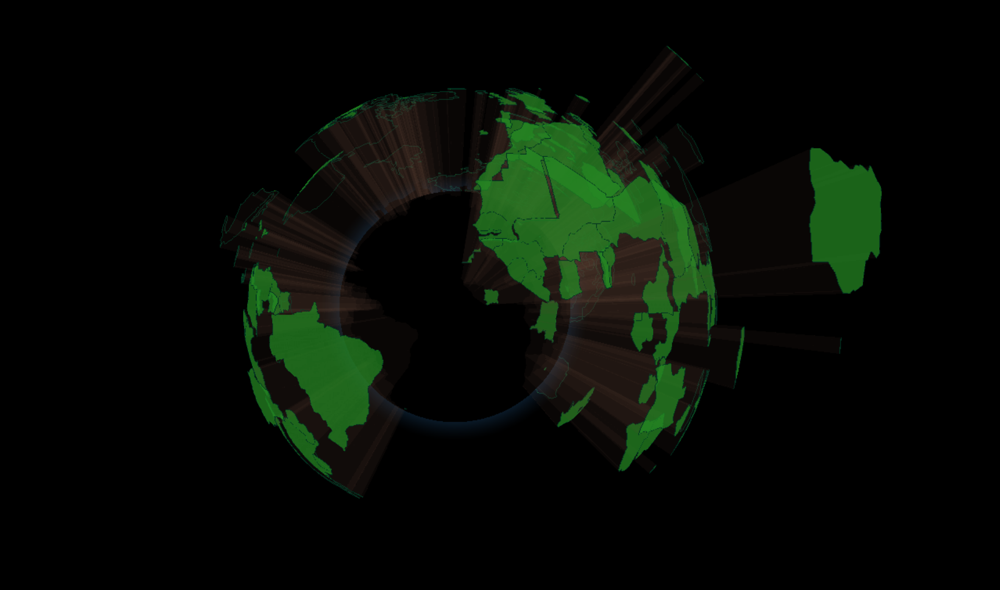

# Where in the world?
"Where in the world" is a simple React/Nextjs web app that uses Three.js and the [three-globe package](https://github.com/vasturiano/three-globe?tab=readme-ov-file) to display a 3D globe visualization of the world with corresponding altitude data based on the provided JSON data. The higher the altitude, the higher the data value. 

In the example provided on the demo page, the data is based on the kilograms of food waste per country in the year of 2021. The data is provided by the World Population Review and can be found [here](https://worldpopulationreview.com/countries).

---
Made with 💖 by Karnikaa Velumani